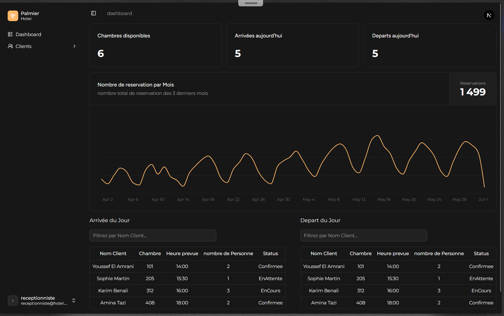

# 🏨 Palmier Hotel — Frontend

Interface web du système de gestion hôtelière, développée avec **Next.js 16** et **TypeScript**.

> ⚠️ **Prérequis** : Le backend doit être lancé avant de démarrer le frontend.  
> Consultez le `README.md` du projet backend pour le configurer et le lancer.

---

## 📋 Prérequis

- Node.js 18+
- npm

---

## 🚀 Installation et lancement

### 1. Cloner le dépôt

```bash
git clone <url-du-repo-frontend>
cd <nom-du-dossier>
```

### 2. Installer les dépendances

```bash
npm install
```

### 3. Configurer le port du backend

Ouvrir le fichier `lib/api.ts` et modifier le port si nécessaire :

```typescript
export const API_BASE_URL = "http://localhost:5241/api"
//                                            ^^^^
//                         Remplacez par le port de votre backend
//                         (visible dans le README backend ou dans
//                          appsettings.json → launchSettings.json)
```


### 4. Lancer l'application

```bash
npm run dev
```

L'application sera disponible sur : **http://localhost:3000**

---

## 🔐 Comptes de test

| Rôle | Email | Mot de passe |
|------|-------|--------------|
| Administrateur | admin@hotel.com | Admin124! |
| Réceptionniste | receptionniste@hotel.com| recep123 |

> Les deux rôles donnent accès à des fonctionnalités différentes (voir ci-dessous).

---

## 🖥️ Aperçu de l'interface



Le dashboard affiche en temps réel :
- Le nombre de chambres disponibles
- Les arrivées et départs du jour
- Le graphique des réservations des 3 derniers mois
- Les tableaux d'arrivées et de départs du jour avec filtrage par nom client

---

## ⌨️ Raccourcis et fonctionnalités UI

| Action | Raccourci / Interaction |
|--------|------------------------|
| Ouvrir / Fermer la sidebar | `Ctrl + B` |
| Basculer Dark / Light mode | Cliquer sur l'icône 🌙 / ☀️ en bas à gauche de la sidebar |
## 👥 Accès par rôle

| Fonctionnalité | Administrateur | Réceptionniste |
|----------------|:--------------:|:--------------:|
| Dashboard | ✅ | ✅ |
| Gestion clients | ✅ | ✅ |
| Gestion chambres | ✅ | ❌ |
| Gestion tarifs | ✅ | ❌ |
| Gestion utilisateurs | ✅ | ❌ |
| Réservations | ✅ | ✅ |
| Check-in / Check-out | ✅ | ✅ |
| Impression facture | ✅ | ✅ |

---

## 🛠️ Stack technique

- **Framework** : Next.js 16.1.7 (App Router avec Turbopack)
- **Langage** : TypeScript 5.9.3
- **Runtime** : React 19.2.4
- **UI** : Tailwind CSS 4.2.1 + shadcn/ui
- **Composants** : Radix UI 1.4.3
- **Icônes** : Lucide React 1.16.0
- **Formulaires** : React Hook Form 7.76.1 + Zod 4.4.3
- **Tables** : TanStack Table 8.21.3
- **Graphiques** : Recharts 3.8.0
- **PDF** : jsPDF 4.2.1
- **Thème** : next-themes 0.4.6
- **Linting** : ESLint 9.39.4 + Prettier 3.8.1

---

## 📦 Scripts disponibles

```bash
# Démarrer le serveur de développement avec Turbopack
npm run dev

# Générer la build de production
npm run build

# Démarrer le serveur de production
npm start

# Lancer ESLint sur le code
npm run lint

# Formater le code avec Prettier
npm run format

# Vérifier les types TypeScript
npm run typecheck
```

---

## 📝 Commandes utiles

```bash
# Installer une nouvelle dépendance
npm install <nom-du-paquet>

# Installer un composant shadcn/ui
npx shadcn-ui@latest add <component-name>
```

---

## 🔧 Configuration

- **Port par défaut** : 3000
- **API Backend** : http://localhost:5241/api (configurable via `.env.local`)
- **Base de données** : Gérée par le backend

---

## 📚 Documentation supplémentaire

- [Next.js Documentation](https://nextjs.org/docs)
- [React Documentation](https://react.dev)
- [Tailwind CSS](https://tailwindcss.com)
- [shadcn/ui](https://ui.shadcn.com)
- [React Hook Form](https://react-hook-form.com)
- [Zod](https://zod.dev)
- [Recharts](https://recharts.org)

---

**Version** : 0.0.1  
**Dernière mise à jour** : Juin 2026
